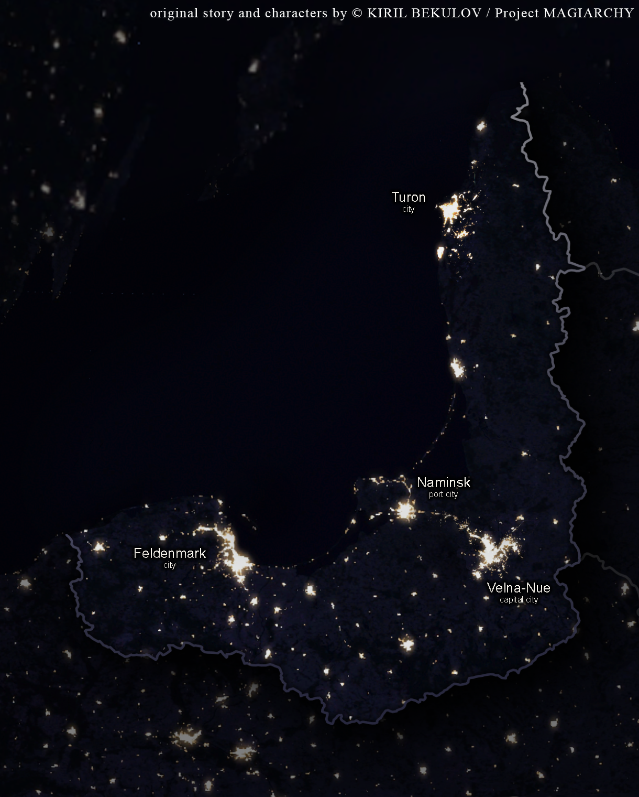
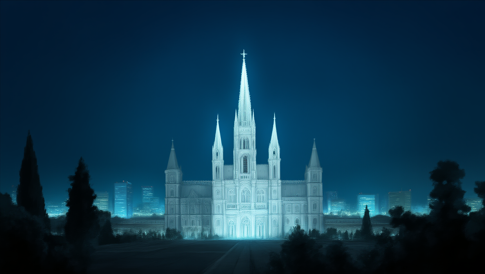
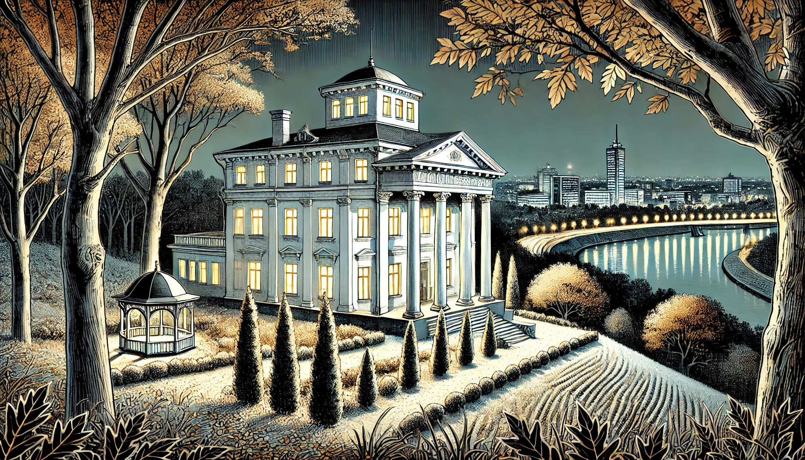

### Lore: The Mage-Church Treaty
- **Treaty Origins:** Long ago, an international agreement was established between mage factions and religious institutions to prevent conflict and maintain secrecy about magic. This treaty, known as the Magiary Accord, governs the delicate balance between the two worlds, with magic being tolerated under strict conditions: it must not interfere with politics, business, or ordinary lives.
- **Church's Role and Methods:** Each religious institution has a covert "cell" comprising a few select members who handle the mage relationship. These cells manage investigations, punish those who violate the treaty, and enforce secrecy. The Church itself does not directly wield magical powers on a wide scale but relies on compliant mages to track, neutralize, or eliminate rogue elements that threaten the balance. Occasionally, it trains select priests to practice thaumaturgy for crises, but such practices are kept minimal and clandestine, aligning with the Church's primary representation of theurgy (internal spiritual transformation).
- **The Symbolic Interplay of Magic and Religion:** In this world, there is no inherent difference between "church magic" and "non-church magic," as all magic is deeply tied to spirituality and religion. Historically, magic originated from the merging of theurgy—the "magic of the soul" or internal transformation—and thaumaturgy—the "magic of the physical world," which involves altering the external environment. The story explores this interplay, where priests embody theurgy, and mages represent thaumaturgy.
- **Mutual Dependence of Theurgy and Thaumaturgy:** The narrative underscores that thaumaturgy cannot function without proper theurgical practice, and vice versa. To change the world around them, mages must first transform themselves through reflection and spiritual growth, highlighting a symbiotic relationship between the two.
- **Compliant vs. Rogue Mages:** Compliant mages align with the Church’s terms, often signaling their allegiance by carrying crosses—anywhere but around their necks—not as symbols of faith, but as marks of cooperation. Despite their utility, they are denied full membership within the Church, reflecting an underlying mistrust. Rogue mages, meanwhile, reject the treaty entirely and are relentlessly hunted by both the Church and their own kind.
- **Tense Partnership:** The treaty exists not from mutual respect but out of pragmatic necessity. The Church lacked the resources to exterminate mage families, and mages lacked the strength to overpower the Church. This uneasy alliance, described as a "cautious partnership," is fraught with mistrust and betrayal, constantly at risk of collapse.
- **Internal Struggles:** The relationship between the Church and the mage community is further complicated by outliers within their ranks who seek to manipulate the treaty for personal or political gain. These actions often lead to additional strain and the need for constant renegotiation.
- **The Setting in the Story:** A pivotal moment tied to this lore appears when Lynleit attends a monastery meeting with her father, Fionn. The event reflects the ongoing negotiations and tensions that underpin the Mage-Church treaty, highlighting Lynleit’s frustration with its complexities and her strained relationship with her stepmother, Helena.

---

### Lore: The Duchy
The duchy, a small yet storied nation, reflects a unique blend of German, Russian, and Baltic influences, emerging as a sovereign state after the Napoleonic Wars. Governed through a delicate balance of parliamentarian rule and symbolic ducal authority, the country's narrative is shaped by various character groups.

The duchy unfolds across the southeastern coast of a vast sea in the north of Europe, its crescent-like geography curving gently along the shoreline. The nation’s borders follow a natural rhythm, combining rugged coasts, dense forests, and sprawling flatlands. Its shape and positioning lend it an air of balance—caught between its historical roots and modern ambitions.
- **Velna-Nue:** The Capital’s Heartbeat. In the southeast, nestled near the coastline but shielded by a network of rivers and hills, stands Velna-Nue, the duchy’s capital. This city is a sprawling hub of political intrigue, cultural heritage, and administrative power. With its dense urban sprawl, Velna-Nue serves as the beating heart of the nation, where the parliament, and key families weave their influence into the fabric of governance. The city also houses the family home of Fionn, which doubles as a secondary headquarters for the MSF.
- **Naminsk:** The Gateway to the Sea. Just north of Velna-Nue, along a calmer stretch of coastline, lies Naminsk, a bustling port city. Its strategic location allows it to serve as a vital economic bridge between the duchy’s inland territories and the outside world. The city is a center of commerce, its character shaped by trade and its proximity to Velna-Nue, from which it draws much of its political and economic energy.
- **Feldenmark:** The Bastion of Nobility. To the southwest, near the western curve of the duchy’s crescent, lies Feldenmark. Known for hosting the royal residence, and for its deep ties to tradition and aristocracy, the city exudes an air of old-world elegance. Its wide boulevards and stately manors stand in stark contrast to the bustling energy of the capital, serving as a reminder of the nation’s aristocratic heritage and its ongoing influence on governance and culture.
- **Turon:** The Northern Frontier. Far to the north, perched on the duchy’s cold frontier, is Turon, the calmest among the largest cities. Strategically distant and isolated, the city houses the primary headquarters of the MSF. It provides Fionn's agency with a degree of insulation from immediate political pressures, allowing it greater autonomy. Turon’s darkened skies make it a place of intrigue and unease, its illuminated clusters a beacon of hidden activity.

---

### Lore: Factions
- **MSF (Private Intelligence Agency):** The MSF, initially a grounded private intelligence agency, serves as a tool for Fionn to engage in political manoeuvring. Unbeknownst to its members, it later becomes entangled in magical affairs as Lynleit transforms it into a smaller, focused organization targeting magical threats.
- **The Church:** Concealing a secret faction, the church engages in diplomatic relations with the global mage community, manoeuvring between religious duties and mystical diplomacy.
- **Government Representatives:** Represented by Drake and Sherie, this group embodies the aristocratic layer of the government, striving to maintain order and stability while unaware of the magical undercurrents.
- **Natalia and Lester:** Natalia, a skilled mage, and Lester, her semi-supernatural assistant, operate a private investigative bureau that takes on cases with magical or supernatural elements.
- **Hiyu, Yulia, and Tarek:** This trio of university students finds themselves drawn into the world of the supernatural as they explore a haunted park, uncovering mysteries and facing paranormal threats.
- **Mika:** Natalia's niece, Mika, studies at a hidden university for mages and is drawn into a mysterious investigation when a friend goes missing, leading her to seek Lynleit's help.
Together, these character groups navigate the complexities of a world where the mundane and the mystical intersect, shaping the duchy's fate.

---

### Lore: On Magic
Magic in this world is an elusive force bestowed by the "mana stream," an inexhaustible source of mystical energy bridging the material and spiritual realms. The mana stream reveals itself to mages through their dreams, transporting them to vivid landscapes reminiscent of Zoroastrian times—vast desert vistas, sacred fire temples, and sprawling ancient cities. Within this dreamscape, the dreamer hears the melodic voice of the "Echo," a hauntingly beautiful song in an ancient tongue, imbued with the wisdom of the long-forgotten Magi. Guided by the Echo’s ethereal melody, mages journey toward the salient points of the mana stream, indicated by flashes of blue flames. The intensity of the flame mirrors a mage's connection to mana, revealing both his potential and ability to wield magic in the real world.

For most mages, the flame remains an ephemeral vision, confined to the dreamscape. Yet, a few rare mage lineages possess the extraordinary gift of manifesting the flame in the real world. This power, both practical and profound, allows Lynleit and a select few others to harness the flame for practical purposes, marking them as singular prodigies in the mage community.

---

### Lore: Holumns
Holumns are supernatural entities recognized within the arcane literature of the mage and Church communities. These beings can manifest as individual creatures like ghosts, werewolves, or vampires, or as sentient natural phenomena such as wind, fog, and rain. Holumns may also exist as curses, influencing events and individuals. Although known to mages and the Church, Holumns are extremely rare, and encountering one is a once-in-a-lifetime event. Their sudden appearance in significant numbers in a specific region signals a major crisis that the mage community and the Church must address immediately.

Yulia's story takes a dramatic turn when she seemingly dies, an event that leaves Hiyu blaming himself for her demise. Later, she reappears as a Holumn, now an antagonist with a corrupted mind and supernatural powers, creating a dark and melodramatic reunion that marks a significant turning point in Hiyu's fate.

---

### Location: Mage Academy
The mage academy is an imposing structure that resembles a grand cathedral, combined with an equally large monastery serving as a dormitory for students. Its architectural style is ornate and intricate, featuring towering spires and elaborate facades. Despite its central location in the capital city, the academy remains invisible to ordinary people and technology. Its concealment lies not in physical invisibility but in a cognitive blind spot for those not aligned with magic. This means that while the building is physically present, the minds of ordinary citizens refuse to acknowledge its existence, creating a perceptual void. This cognitive dissonance extends to technology, leaving the building absent from photographs, satellite imagery, and video recordings. Only those with a specific magical alignment can break through this cognitive barrier, allowing them to perceive and explore the academy in all its splendour.

---

### Lore: The Weave of Leviathan
A fabric of shifting forms, the Weave of Leviathan is an ancient cloth gifted to Lynleit by her father, Fionn. It remains concealed within the threads of her blue coat (and the sash at Witch Lyn's waist), appearing as ordinary fabric until it moves. The cloth acts of its own will, guided by an unseen intelligence—one that does not always align with its wearer’s intent.

The Weave can morph, taking on different shapes when it perceives danger. In one moment, it unfurls into a long scarf, coiling around Lynleit’s leg to catch her mid-fall from a collapsing bridge. In another, it tightens into a ribbon, threading itself through furniture, winding around her throat in a silent act of defiance. The Leviathan within watches, decides, and acts—whether to protect or to restrain.

---

### Location: Lynleit's Family House
Lynleit's family house is a neoclassical mansion with white walls and pillars, nestled on a tall hill overlooking the main river and the city of Velna-Nue. It features a spacious garden and a neoclassical gazebo, offering perfect views of both the river and the cityscape. Hidden behind trees, the mansion becomes more visible in autumn when the leaves fall. Positioned near the city centre, it offers both privacy and a commanding view of the surroundings.

---

### Story: Romantic Subplots
Felix, Lynleit’s trusted colleague and bodyguard, is a charming and flirtatious figure, often seen engaging in playful banter and romantic escapades with others. Despite harboring a quiet, unspoken admiration for Lynleit, he views her as distant, not just due to her position but because of an inherent sense of imbalance between them. This perceived disparity leaves Felix unable to act on his feelings, fostering a subtle vulnerability that manifests as jealousy and insecurity when Kyrien, an enigmatic and self-driven newcomer, joins their circle. Felix’s initial hostility toward Kyrien stems not only from professional suspicion but from an instinctive recognition of Kyrien as Lynleit’s equal—a potential partner in both purpose and spirit.

Kyrien’s dynamic with Lynleit begins in sharp contrast. Their relationship is forged under strained circumstances, with Kyrien perceiving Lynleit as a manipulative force who corners him into an uneasy alliance. Her promises to aid him in his personal quest to uncover his father’s murderer force him to concede to her terms, leaving him grappling with feelings of vulnerability and resentment. Yet as their partnership evolves, Kyrien begins to see Lynleit not merely as a calculating leader but as someone with a depth of empathy and conviction that provokes his curiosity. This growing sense of equality between them unsettles him, challenging his guarded nature and creating an unspoken tension he struggles to repress.

For Lynleit, Kyrien represents a puzzle—an adversarial yet compelling presence that draws her in against her better judgment. Though initially dismissive of him as anything more than a reluctant ally, she becomes increasingly intrigued by his complexity and motivations. As their shared experiences bring them closer, Lynleit finds herself grappling with feelings she cannot fully understand or articulate, an inner conflict that mirrors Kyrien’s. Their mutual recognition of each other as equals heightens their dynamic, introducing a simmering tension that neither is prepared to confront openly.

Their bond reaches a critical juncture during a life-or-death encounter, where the stakes force them into a moment of intimacy born of necessity rather than desire. Though both agree to suppress and move past the incident, the act leaves a lasting mark on their relationship. The unacknowledged connection between them fuels a silent, unspoken tension that permeates their interactions, creating a mix of longing, regret, and repressed emotions. Meanwhile, Felix’s growing awareness of this evolving dynamic heightens his own insecurities, adding another layer of complexity to the trio’s already fraught relationships.

---

### Story: The Final Truth
Lynleit’s world—the Duchy with its aristocracy, factions, and supernatural conflicts—is not perfect. It unravels as anomalies and inconsistencies become increasingly evident: it is not real. As a witch of unparalleled power, Lynleit unknowingly created this illusion, crafting an intricate reality to escape the harsh truths of the real world. However, her illusion is flawed, plagued by instability that manifests as disappearances, Holumns, and strange glitches in her surroundings. Characters often experience phenomena akin to déjà vu and the Mandela Effect, brushing these feelings aside as fleeting oddities. Yet, as time progresses, the anomalies grow more uncanny, and Lynleit becomes the primary observer of these distortions.

Haunted by a growing sense of unease, Lynleit feels something is profoundly wrong with her world. This gnawing sensation intensifies when she begins to catch glimpses of an ominous silhouette standing behind her in mirrors. The figure appears ghostly, its features blurred and indistinct, vanishing the moment she turns to confront it. Similarly, when Lynleit uses her magic to walk on water, the silhouette occasionally materializes in the reflection below her feet, its presence unsettling yet not overtly malign—at least at first. These haunting visions deepen her discomfort, feeding into the dread that something is unraveling around her.

As the illusive world begins to collapse, Lynleit is forced to confront the truth of her own creation, her suppressed memories, and the moral weight of trapping real people within her fantastical construct. The Duchy, with all its intricate details, begins to come undone as the boundaries between reality and illusion blur. While many within her circle come to realize that some of them are merely figments of Lynleit’s imagination, others discover they are real individuals, drawn into her world with their memories overwritten.

A darker reflection of her true self begins to emerge, confronting her through mirrors, reflections, and fleeting shadows. This manifestation accuses her of running from reality and forcing others to share in her fabricated dream. Lynleit wrestles with guilt and self-doubt as her carefully constructed reality crumbles, leaving her to face the consequences of her unparalleled power.

While most accept the inevitability of the illusion’s collapse and their erasure with it, Lynleit refuses to let her creation vanish entirely. In a final act of defiance and redemption, she confronts her other self, unlocking the full extent of her powers. Through this confrontation, Lynleit endeavors to rescue a fraction of her world, merging the real and illusionary into a harmonious new existence. Her act of creation and redemption reshapes the fabric of reality forever, cementing her legacy as both a creator and redeemer even as it forces her to accept the sacrifices demanded by her actions.

---